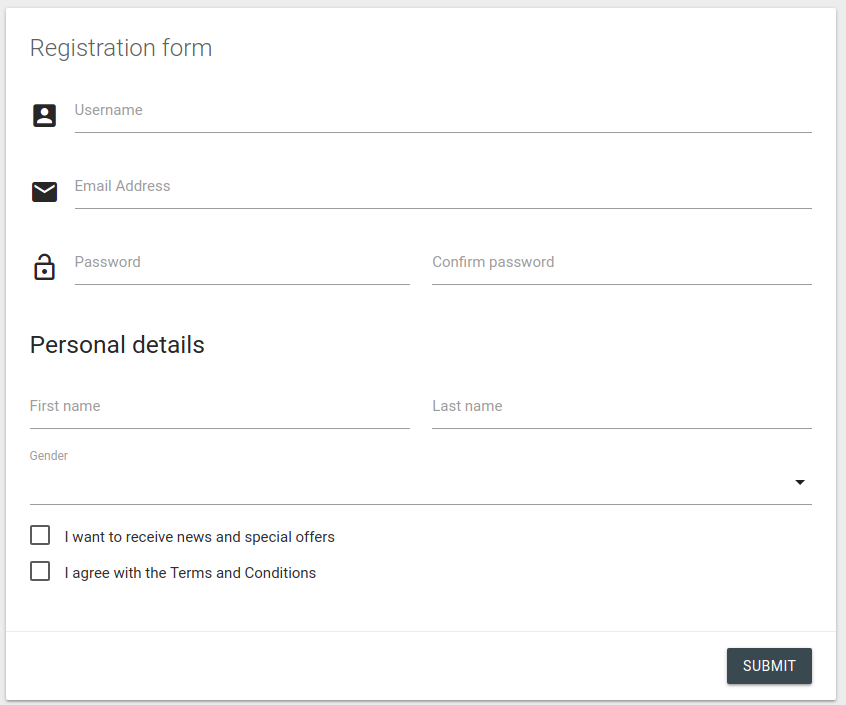

===============
Django Material
===============

Material design for Django Forms and Admin. Template driven.

.. image:: https://img.shields.io/pypi/v/django-material.svg
    :target: https://pypi.python.org/pypi/django-material

.. image:: https://travis-ci.org/viewflow/django-material.svg
    :target: https://travis-ci.org/viewflow/django-material

.. image:: https://badges.gitter.im/Join%20Chat.svg
   :alt: Join the chat at https://gitter.im/viewflow/django-material
   :target: https://gitter.im/viewflow/django-material?utm_source=badge&utm_medium=badge&utm_campaign=pr-badge&utm_content=badge

Overview
========

- Forms_ - New way to render django forms

  * Strong python/html code separation
  * Easy redefinition of particular fields rendering
  * Complex form layout support

- Frontend_ - Quick starter template for modular applications development

- Admin_ - Material-designed django admin

Demo: http://forms.viewflow.io/

Documentation
=============

http://docs.viewflow.io/material_forms.html

License
=======

Django Material is an Open Source project licensed under the terms of the `BSD3 license <https://github.com/viewflow/django-material/blob/master/LICENSE.txt>`_

Django Material Pro has a commercial-friendly license and distributed as part of Viewflow Pro

Changelog
=========

0.9.2 2016-10-27 - Beta
-----------------------

- Fix admin read-only field for simple values
